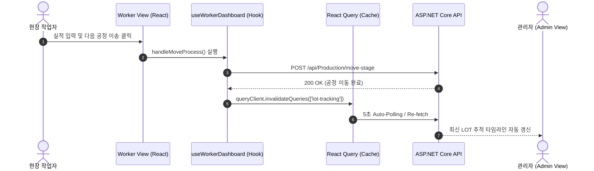

# 📐 MES Front-End Architecture & Developer Guide

본 문서는 **MES (Manufacturing Execution System) 프론트엔드** 애플리케이션의 내부 구조, 아키텍처 패턴, 데이터 흐름, 컴포넌트 구성 요소 및 개발 컨벤션을 정리한 기술 문서입니다.

---

## 1. 🏗️ 아키텍처 개요 (Overview)

본 시스템은 **React 19 + TypeScript + Vite** 환경에서 구축되었으며, 백엔드(`ASP.NET Core Web API`)와 연동하여 제조 현장의 데이터를 실시간으로 모니터링하고 제어합니다.

### 💡 핵심 설계 원칙
1. **도메인 중심의 모듈화 (Domain-Driven Organization)**: 컴포넌트와 훅을 관리자(`admin`), 작업자(`worker`), 공통(`common`) 도메인별로 명확히 분리.
2. **서버 상태 & 클라이언트 상태 분리**:
   - **서버 데이터 (Server State)**: `TanStack React Query v5`를 사용하여 5초 주기의 Auto-Polling 동기화 및 쿼리 캐싱 관리.
   - **전역 UI/인증 상태 (Client State)**: `React Context API (AppContext)`를 통한 역할(Role) 및 인증 상태 관리.
3. **디자인 시스템 표준화**: 인라인 스타일을 배제하고 `styled-components` 기반의 Theme-driven 디자인 가이드 준수 (`import * as S` 형태).

---

## 2. 📂 디렉토리 구조 및 레이어링 규칙 (Folder Structure)

```text
mes_front/
├── src/
│   ├── api/                  # Axios / Custom Fetcher 통신 모듈
│   │   ├── client.ts         # BaseURL 설정 및 Interceptor
│   │   └── fetcher.ts        # REST API 통신 함수 모음
│   ├── components/           # React UI 컴포넌트
│   │   ├── common/           # 🧩 공통 컴포넌트 (Modal, Spinner)
│   │   ├── admin/            # 🏢 관리자 대시보드 도메인 그룹
│   │   │   ├── material/     #   - RawMaterialStatus, CreateMaterialModal, StockUpdateModal
│   │   │   ├── workOrder/    #   - WorkOrderForm, WorkOrderList
│   │   │   ├── shipment/     #   - ShipmentForm, ShipmentList
│   │   │   ├── lotTracker/   #   - LotProcessTracker, LotSearchPanel, LotDetailsPanel
│   │   │   └── analytics/    #   - ProcessStageQualityCard, useProcessStageData
│   │   └── worker/           # 👷 작업자 패널 도메인 그룹
│   │       ├── controlPanel/ #   - WorkerControlPanel, WorkerDefectForm, WorkerStageStepper
│   │       └── orderList/    #   - WorkerOrderList
│   ├── context/              # 전역 상태 (AppContext: 사용자 역할 및 인증 상태)
│   ├── layouts/              # 앱 통합 레이아웃 (Layout.tsx: 헤더 및 Role Switcher)
│   ├── pages/                # 라우트 페이지 및 비즈니스 커스텀 훅
│   │   ├── admin/            #   - Dashboard.tsx, Dashboard.styles.ts, useDashboard.ts
│   │   ├── worker/           #   - WorkerDashboard.tsx, WorkerDashboard.styles.ts, useWorkerDashboard.ts
│   │   └── login/            #   - Login.tsx
│   ├── styles/               # 전역 테마 및 스타일 (theme.ts, GlobalStyle.ts)
│   └── types/                # TypeScript 타입 및 인터페이스 정의
```

---

## 3. 🔄 데이터 흐름 & 상태 관리 (Data Flow)

### 3.1 실시간 처리 시퀀스 (Sequence Diagram)



### 3.2 React Query 키 (Query Keys) 및 폴링 정책
- `['products']`: 원자재 마스터 목록 및 재고 상태 (`refetchInterval: 5000`)
- `['work-orders']`: 작업지시 목록 및 진척율 (`refetchInterval: 5000`)
- `['lot-tracking', lotId]`: 특정 LOT의 공정 이동 이력 및 타임라인
- `['defect-reasons']`: 불량 사유 코드 마스터 목록

---

## 4. 🎨 디자인 시스템 & 스타일 규격

### 🌌 테마 컨셉: Midnight Neon Glassmorphism
- **기반 기술**: `styled-components` (ThemeProvider 활용)
- **주요 HSL 컬러 세팅**:
  - 배경: 다크 인더스트리얼 네이비 (`#0b0f19`)
  - 정상/정상공정: **Neon Cyan** (`#00f2fe`)
  - 경고/부족/보류: **Neon Crimson** (`#ff4b5c`)
  - 완료/승인: **Neon Green** (`#00e676`)
- **스타일 파일 분리 규칙**:
  - 컴포넌트 파일과 1:1로 매핑되는 `[ComponentName].styles.ts` 작성
  - 컴포넌트 내부에서 `import * as S from './[ComponentName].styles'` 로 일관성 유지

---

## 5. 🛡️ 예외 처리 & 2중 안전 방어막 (Safety Guards)

1. **무단 공정 건너뛰기 차단**:
   - 현재 공정 양품 수량이 0인 경우 다음 공정 이송 버튼 비활성화 및 경고 표출.
2. **보류(HOLD) 상태 격리 차단**:
   - 불량 발생 시 해당 LOT 상태가 `HOLD`로 자동 변경되며 모든 제어 버튼 비활성화.
   - 관리자의 보류 해제(`RELEASE`) 전까지 작업자 화면 조작 불가.

---

## 📝 문서 유지보수 규칙

1. **새로운 API 추가 시**: `src/api/fetcher.ts` 및 본 문서의 **Query Keys** 섹션 갱신
2. **신규 컴포넌트 추가 시**: 본 문서의 **디렉토리 구조** 및 레이어링 규칙 준수
