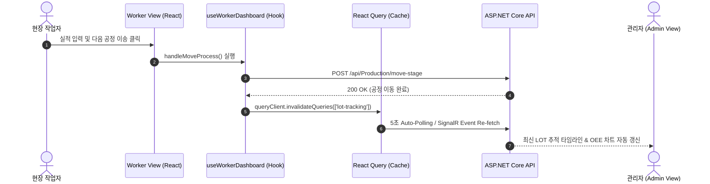

# 📐 MES Front-End Architecture & Developer Guide

본 문서는 **MES (Manufacturing Execution System) 프론트엔드** 애플리케이션의 내부 구조, 설계 원칙, 데이터 흐름, 컴포넌트 구성 요소 및 코딩 컨벤션을 정리한 개발자 아키텍처 가이드입니다.

---

## 1. 아키텍처 개요 (Overview)

본 시스템은 **React 18 + TypeScript + Vite** 환경에서 구축되었으며, 백엔드(`ASP.NET Core Web API`)와 연동하여 제조 현장의 데이터를 실시간으로 모니터링하고 제어합니다.

### 💡 핵심 설계 원칙
1. **도메인 중심의 모듈화 (Domain-Driven Organization)**: 컴포넌트와 훅을 관리자(`admin`), 작업자(`worker`), 공통(`common`) 도메인별로 명확히 분리.
2. **서버 상태 & 클라이언트 상태 분리**:
   - **서버 데이터 (Server State)**: `TanStack React Query v5`를 사용하여 불필요한 주기적 네트워크 폴링(Polling)을 배제하고, `SignalR` 웹소켓 실시간 이벤트 푸시 시 쿼리 캐시를 스마트 무효화(`invalidateQueries`)하는 Event-driven 구조.
   - **실시간 웹소켓 이벤트 (Real-time Event)**: `@microsoft/signalr` 기반 웹소켓 연결로 설비 상태, 재고 경고, LOT HOLD, 센서 수량 수신 시 실시간 캐시 갱신 및 전역 알림.
   - **전역 UI/인증 상태 (Client State)**: `React Context API (AppContext, SignalRContext, NotificationContext)`를 통한 전역 토스트 및 인증 상태 관리.
3. **디자인 시스템 표준화**: 인라인 스타일을 배제하고 `styled-components` 기반의 Theme-driven 디자인 가이드 준수 (`import * as S` 네임스페이스 및 `ThemeProvider` 적용).

---

## 2. 📂 디렉토리 구조 및 레이어링 규칙

```text
mes_front/
├── src/
│   ├── api/                    # 백엔드 REST API 통신 클라이언트 및 Fetcher 함수
│   │   ├── client.ts           # Axios / Custom Fetcher 인스턴스 (BaseURL, Interceptor)
│   │   └── fetcher.ts          # API Endpoint 연동 함수 모음
│   ├── components/             # React UI 컴포넌트
│   │   ├── common/             # Modal, Spinner 등 서비스 전반 공통 컴포넌트
│   │   ├── admin/              # 관리자 대시보드 도메인 컴포넌트
│   │   │   ├── material/       #   - RawMaterialStatus, CreateMaterialModal, StockUpdateModal
│   │   │   ├── workOrder/      #   - WorkOrderForm, WorkOrderList
│   │   │   ├── shipment/       #   - ShipmentForm, ShipmentList
│   │   │   ├── lotTracker/     #   - LotProcessTracker, LotSearchPanel, LotDetailsPanel
│   │   │   ├── equipment/      #   - EquipmentStatusSection, EquipmentCard, DowntimeReasonModal
│   │   │   └── analytics/      #   - AnalyticsSection, OeeAnalyticsChart, ProductionQualityChart
│   │   └── worker/             # 작업자 실행 패널 도메인 컴포넌트
│   │       ├── controlPanel/   #   - WorkerControlPanel, WorkerDefectForm, WorkerStageStepper
│   │       └── orderList/      #   - WorkerOrderList
│   ├── context/                # 전역 Context (AppContext, SignalRContext, NotificationContext)
│   ├── hooks/                  # 비즈니스 커스텀 훅 & SignalR 리스너
│   │   ├── useSignalR.ts       # SignalR HubConnection 수명주기 관리 훅
│   │   ├── useSignalRListener.ts # 실시간 서버 이벤트 수신 및 React Query 캐시 갱신 훅
│   │   └── useSensorStream.ts  # 실시간 센서 데이터 스트림 처리 훅
│   ├── layouts/                # 앱 공통 헤더 및 역할 전환(Role Switcher) 레이아웃
│   ├── pages/                  # 라우트 페이지 컴포넌트 및 비즈니스 훅
│   │   ├── admin/              #   - Dashboard.tsx, Dashboard.styles.ts, useDashboard.ts
│   │   ├── worker/             #   - WorkerDashboard.tsx, WorkerDashboard.styles.ts, useWorkerDashboard.ts
│   │   └── login/              #   - Login.tsx
│   ├── styles/                 # Theme, GlobalStyle (Midnight Neon 테마 규격)
│   └── types/                  # TypeScript 인터페이스 및 타입 정의 (equipment.ts, sensor.ts 등)
```

---

## 3. 🔄 데이터 흐름 & 상태 관리 (Data Flow)


```mermaid
sequenceDiagram
    autonumber
    actor Worker as 현장 작업자
    participant UI as Worker View (React)
    participant Hook as useWorkerDashboard (Hook)
    participant RQ as React Query (Cache)
    participant API as ASP.NET Core API
    actor Admin as 관리자 (Admin View)

    Worker->>UI: 실적 입력 및 다음 공정 이송 클릭
    UI->>Hook: handleMoveProcess() 실행
    Hook->>API: POST /api/Production/move-stage
    API-->>Hook: 200 OK (공정 이동 완료)
    Hook->>RQ: queryClient.invalidateQueries(['lot-tracking'])
    RQ->>API: 5초 Auto-Polling / SignalR Event Re-fetch
    API-->>Admin: 최신 LOT 추적 타임라인 & OEE 차트 자동 갱신
```

### 쿼리 캐시 키 구조 (Query Keys)
- `['products']` / `['rawMaterials']`: 원자재 마스터 목록 및 재고 상태 (재고 변경 이벤트 수신 시 무효화)
- `['work-orders']` / `['workOrders']`: 작업지시 목록 및 진척율 (작업지시 갱신/센서 이벤트 수신 시 무효화)
- `['lot-tracking']` / `['lots']`: 실시간 LOT 공정 이동 이력 및 타임라인 (LOT 이동/불량 이벤트 수신 시 무효화)
- `['equipments']`: 전체 설비 상태 및 가동/비가동 시간 (설비 상태 변경/센서 이벤트 수신 시 무효화)
- `['oeeStats']` / `['oeeSummary']`: 설비 종합 효율(OEE) 3대 지표 분석 (SignalR 이벤트 수신 시 무효화)
- `['shipments']`: 완제품 출하 이력 목록
- `['downtimeReasons']`: 비가동 사유 마스터 코드 목록

---

## 4. 🎨 디자인 시스템 & 스타일 규격

### 🌌 테마 컨셉: Midnight Neon Glassmorphism
- **배경색**: 다크 인더스트리얼 네이비 (`#0b0f19`)
- **주요 포인트 컬러**:
  - 정상/정상공정: **Neon Cyan** (`#00f2fe`)
  - 경고/부족/보류: **Neon Crimson** (`#ff4b5c`)
  - 완료/승인: **Neon Green** (`#00e676`)
- **스타일 분리 규칙**:
  - 컴포넌트와 동일한 위치에 `[ComponentName].styles.ts` 분리 작성
  - 컴포넌트 내에서는 `import * as S from './[ComponentName].styles'` 로 상대 경로 또는 `@/` 별칭(Alias)으로 임포트
  - 전역 스타일은 `src/styles/GlobalStyle.ts` 및 `ThemeProvider`로 통일

---

## 5. 🛡️ 예외 처리 & 2중 안전 방어막 (Safety Guards)

1. **무단 공정 건너뛰기 차단**:
   - 현재 공정 양품 수량이 0인 경우 다음 공정 이송 버튼 비활성화 및 토스트/경고 표출.
2. **보류(HOLD) 상태 격리 차단**:
   - 불량 입력으로 LOT 상태가 `HOLD`로 바뀌면 작업자 패널의 모든 제어 버튼 비활성화.
   - 관리자가 승인(`RELEASE`)하기 전까지 추가 실적 입력 차단.
3. **SignalR 수신 예외 안전 처리**:
   - 서버에서 브로드캐스팅하는 실시간 센서/설비 이벤트(`ReceiveSensorCountUpdated`, `ReceiveEquipmentStatusChanged`) 수신 리스너를 연동하여 콘솔 경고 및 연결 유실 방지.

---

## 6. 📝 문서 유지보수 가이드 (Documentation Maintenance)

신규 기능 추가 시 아래 문서를 함께 업데이트합니다.
1. **새로운 API 연동 시**: `src/api/fetcher.ts` 및 `README.md` 기능 설명 갱신
2. **현장 테스트 시나리오 변경 시**: `mes_solution_acceptance_test_guide.md` 갱신
3. **새로운 도메인/커스텀 훅 추가 시**: 본 `docs/FRONTEND_ARCHITECTURE.md` 디렉토리 트리 및 Query Key 갱신
