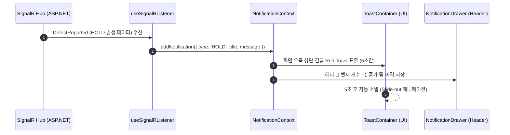

# 🚨 [Feature Issue] MES 실시간 현장 이벤트 토스트 알림 & 알림 센터 구현

> **Issue ID**: `#MES-FE-01`  
> **Type**: Feature / Enhancement  
> **Priority**: High (P1)  
> **Category**: Shop Floor Control & Real-Time Monitoring  
> **Target Module**: `src/context/NotificationContext.tsx`, `src/hooks/useSignalRListener.ts`, `src/components/common/ToastContainer.tsx`

---

## 📌 1. 개요 및 배경 (Background & Problem Statement)

현재 프론트엔드의 `useSignalRListener.ts`는 백엔드(`mes_server`)로부터 SignalR 실시간 웹소켓 이벤트(`DefectReported`, `StockUpdated`, `LotUpdated`, `WorkOrderUpdated`)를 수신하여 React Query 캐시를 실시간 리패치(Invalidation)하고 있습니다.

그러나 **시각적/청각적 알림 UI가 부재**하여, 관리자나 작업자가 대시보드 화면을 직접 주시하지 않으면 아래와 같은 현장 예외 상황을 즉시 인지하기 어렵습니다.
- 현장에서 **불량이 발생하여 LOT가 `HOLD(보류)` 상태로 전환**된 경우
- 원자재 입출고로 인해 **안전 재고 미만 수량 경고**가 발생한 경우
- 작업지시 생산이 **최종 완료(COMPLETE)**되었을 때

따라서 MES의 본질인 **"현장 즉각 대응력"**을 극대화하기 위해 실시간 **네온 토스트(Toast) 팝업**과 **알림 센터(Notification Drawer)**를 구현합니다.

---

## 🏗️ 2. 아키텍처 및 시스템 설계 (Architecture)

---

## 📋 3. 상세 기능 명세 (Detailed Requirements)

### 3.1 전역 알림 상태 관리 (`NotificationContext.tsx`)
- **알림 항목 인터페이스 (`NotificationItem`)**:
  - `id`: string (UUID or Timestamp)
  - `type`: `'HOLD'` (긴급 보류 - Red) | `'WARN'` (재고 경고 - Yellow) | `'SUCCESS'` (완료 - Green) | `'INFO'` (일반 - Cyan)
  - `title`: string (예: "🚨 LOT 품질 보류(HOLD) 발생")
  - `message`: string (예: "LOT-20260729-001 공정 중 불량 2개 등록 (치핑)")
  - `timestamp`: Date
  - `isRead`: boolean
- **주요 메서드**:
  - `addNotification(noti: Omit<NotificationItem, 'id' | 'timestamp' | 'isRead'>)`
  - `markAsRead(id: string)`
  - `markAllAsRead()`
  - `removeNotification(id: string)`

### 3.2 실시간 토스트 UI (`ToastContainer.tsx` & `ToastItem.tsx`)
- **위치**: 화면 우측 상단 (Top-Right Fixed Stack)
- **스타일링**: Midnight Neon Glassmorphism 디자인 적용
  - `HOLD`: Neon Crimson (`#ff4b5c`) 보더 및 글레이징
  - `WARN`: Neon Amber (`#ffb703`)
  - `SUCCESS`: Neon Green (`#00e676`)
  - `INFO`: Neon Cyan (`#00f2fe`)
- **동작**:
  - 생성 후 5초 뒤 자동 Fade-out 및 제거
  - 사용자가 X 버튼 클릭 시 즉시 닫힘
  - 호버(Hover) 시 자동 소멸 타이머 일시 정지

### 3.3 헤더 알림 센터 드로어 (`NotificationDrawer.tsx`)
- `Layout.tsx` 헤더 우측에 🔔 종 모양 알림 아이콘 배치
- 안 읽은 알림 개수를 빨간 뱃지(Badge) 숫자로 표시
- 클릭 시 우측에서 슬라이딩되는 드로어 패널을 열어 누적 알림 이력 확인 및 "모두 읽음" 처리

### 3.4 SignalR 이벤트 통합 (`useSignalRListener.ts`)
- `DefectReported`: `HOLD` 타입 토스트 트리거 ("🚨 [보류] LOT {lotId} 불량 발생 - {reason}")
- `StockUpdated`: 안전재고 이하인 품목 수신 시 `WARN` 타입 토스트 트리거 ("⚠️ [재고 경고] 원자재 재고 부족")
- `WorkOrderUpdated`: 상태가 `COMPLETE`일 경우 `SUCCESS` 타입 토스트 트리거 ("✅ [완료] 작업지시 마감 완료")

---

## 🛠️ 4. 하위 작업 목록 (Sub-task Checklist)

- [x] **Task 1**: `src/types/notification.ts` 알림 인터페이스 및 타입 정의
- [ ] **Task 2**: `src/context/NotificationContext.tsx` 생성 및 `App.tsx` 프로바인더 배치
- [ ] **Task 3**: `src/components/common/toast/ToastContainer.tsx` & `ToastItem.styles.ts` 네온 토스트 컴포넌트 구현
- [ ] **Task 4**: `src/components/common/notification/NotificationDrawer.tsx` 및 헤더 🔔 아이콘 연동
- [ ] **Task 5**: `src/hooks/useSignalRListener.ts` 수정 - SignalR 수신 시 `addNotification` 연동
- [ ] **Task 6**: UAT 및 테스트 - 현장 작업자 화면에서 불량 등록 시 관리자 화면에 1초 이내 토스트 팝업 표출 확인

---

## 🎯 5. 최종 수용 기준 (Acceptance Criteria)

1. 현장 작업자가 `WorkerDashboard`에서 불량을 입력하여 LOT가 `HOLD` 상태로 전환되면, 관리자 및 다른 작업자 화면 우측 상단에 1초 이내에 Red Neon 토스트 팝업이 출력되어야 한다.
2. 토스트 팝업은 5초간 지속 후 매끄럽게 사라지며, X 버튼으로 즉시 제거 가능해야 한다.
3. 헤더의 🔔 알림 뱃지 카운트가 실시간으로 1 증가하고, 알림 드로어에서 이력을 클릭하거나 '모두 읽음' 처리가 가능해야 한다.
