# Mini-MES 솔루션 검수 문서

> 기준: 현재 `mes_front` 구현과 `src/docs`의 기능 시연 자료
>
> 목적: 관리자와 작업자가 작업지시부터 생산·비가동·LOT 추적·출하까지의 흐름을 수행할 수 있는지 검수한다.

## 1. 검수 범위

- 관리자: 자재 재고 관리, 작업지시 생성·마감, LOT 추적, OEE 분석, 출하 관리
- 작업자: 설비 선택 생산 시작, 센서 수량 모니터링, 불량 등록·보류, 공정 이동, 비가동 사유 등록
- 공통: REST API와 SignalR을 통한 화면 갱신 및 데이터 일관성

## 2. 사전 준비

1. `mes_server`, SQL Server, `mes_front`를 실행한다.
2. 관리자와 작업자 계정으로 각각 로그인한다.
3. 제품, BOM, 공정, 설비, 불량 사유 및 비가동 사유 기준정보를 준비한다.
4. OPC 연동 검수 시 Kepware와 CNC 설비 Counter/Running/Temperature 태그를 정상 상태로 준비한다.

## 3. 기능별 검수 시나리오

### AC-01. 작업지시 생성

관리자가 제품과 계획 수량을 입력해 작업지시를 등록한다.

- 기대 결과: 작업지시가 목록에 표시되고 대상 LOT이 생성된다.
- 확인 항목: 제품, 목표 수량, 시작일, 납기일, 작업지시 상태 및 LOT의 첫 공정.
- 시연 자료: 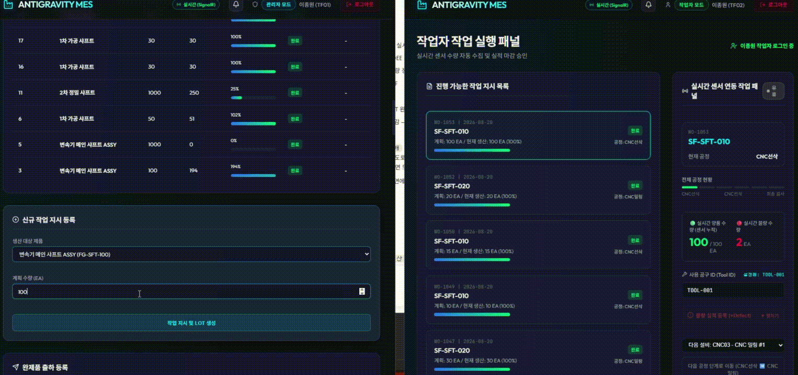

### AC-02. 자재 재고 및 부족 알림

관리자가 원자재를 등록하거나 수량·안전재고를 변경한 뒤, 부족한 자재의 상태를 확인한다.

- 기대 결과: 변경한 재고가 자재 현황에 반영된다.
- 확인 항목: 재고 수량, 안전재고 기준, 부족 상태 알림, 생산 시작 전 원자재 부족 차단.
- 시연 자료: 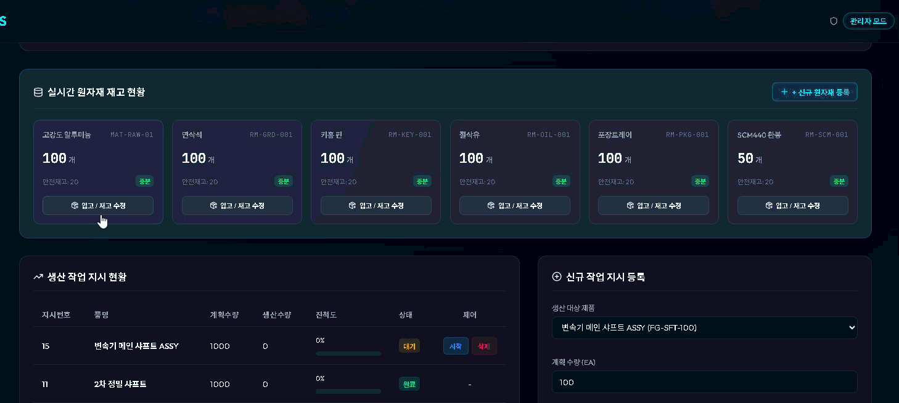

### AC-03. 설비 선택 생산 시작과 실시간 수집

작업자가 작업지시를 선택하고 사용할 설비를 선택해 생산을 시작한다. 설비 Counter를 증가시켜 자동 수집 결과를 확인한다.

- 기대 결과: 선택한 LOT이 설비에 연결되고 작업지시·LOT·설비 상태가 생산 중으로 갱신된다.
- 확인 항목: 선택 설비만 해당 LOT을 점유하는지, Counter 증가량이 양품/불량 수량에 반영되는지,
- 시연 자료: 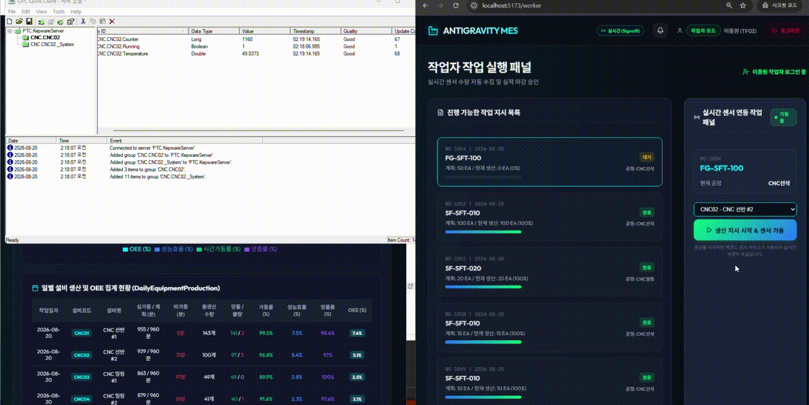

### AC-04. 다공정 이동

작업자가 현재 공정을 완료한 후 다음 공정으로 이동하고, 필요 시 다음 설비를 지정한다.

- 기대 결과: LOT의 현재 공정이 다음 순서로 변경되며 기존 실적이 중복 등록되지 않는다.
- 확인 항목: 공정 순서, LOT 이력, 설비 변경, 0수량 공정 이동 시 실적 중복 여부.
- 시연 자료: 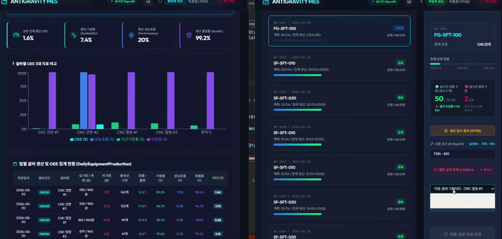

### AC-06. 비가동 기록과 사유 등록

설비가 비가동 상태가 된 뒤 작업자가 비가동 사유와 메모를 등록한다.

- 기대 결과: 열린 비가동 이력에 사유가 연결되고 일일 설비 실적/OEE 관련 화면이 갱신된다.
- 확인 항목: 설비, 시작·종료 시각, 비가동 시간, 사유 코드, 작업자 메모.
- 시연 자료: 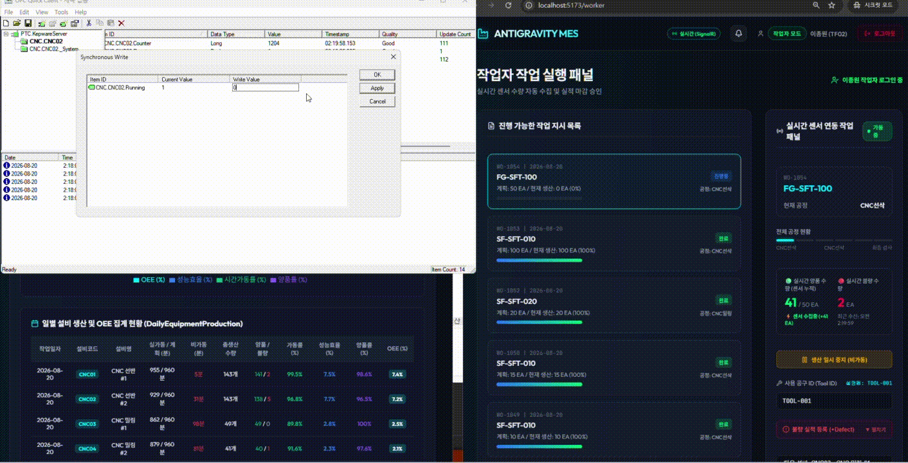, 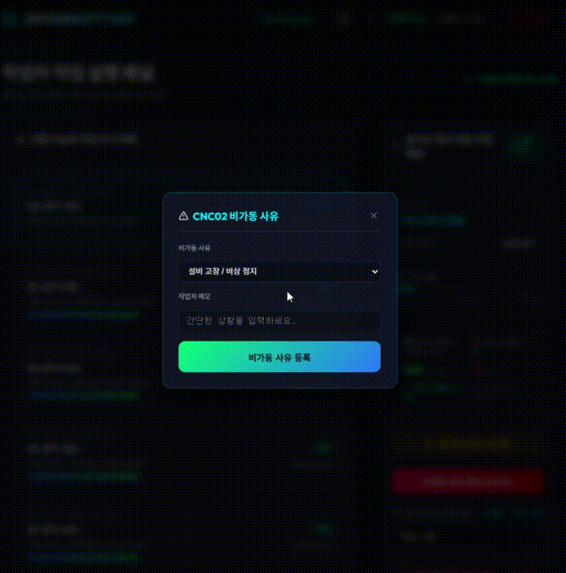

### AC-07. 재가동

재가동 신호가 오면 다시 재생산을 한다.

- 기대 결과: 기존의 비가동 사유 입력 버튼이 사라지고 다시 생산 센서 신호가 들어오며 실적이 등록
- 확인 항목: 설비, Counter 증가량이 양품/불량 수량에 반영되는지,
- 시연 자료: 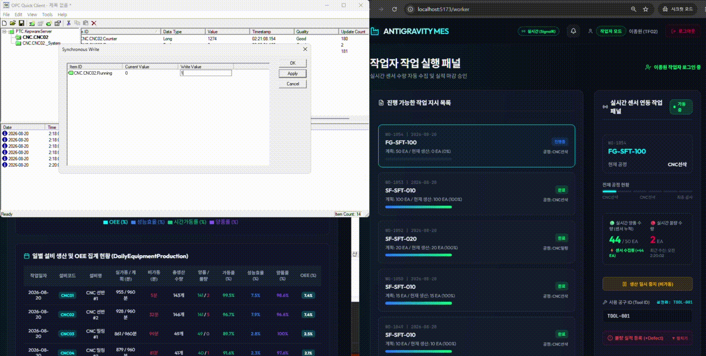

### AC-07. 생산 완료

작업자가 최종 공정 완료 후 작업지시를 마감한다.

- 기대 결과: 작업지시와 LOT이 완료 상태로 변경되고 설비의 LOT 연결이 해제된다.
- 확인 항목: 최종 양품 수량, 작업지시/LOT 완료 상태, 완제품 재고 반영, 마감 후 추가 실적 차단.
- 시연 자료:

  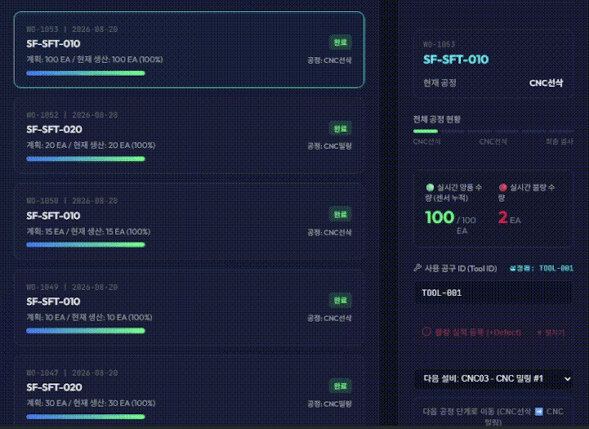

### AC-08. LOT 추적 및 OEE 분석

관리자가 LOT의 공정 진행 이력과 일일 설비 OEE 분석을 확인한다.

- 기대 결과: LOT별 현재 공정·상태·이력이 추적되고, 일일 OEE가 설비별 생산 및 비가동 데이터와 함께 표시된다.
- 시연 자료: 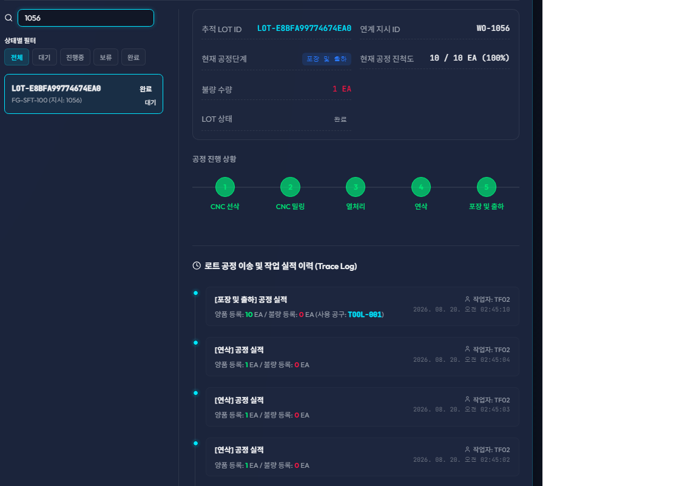, 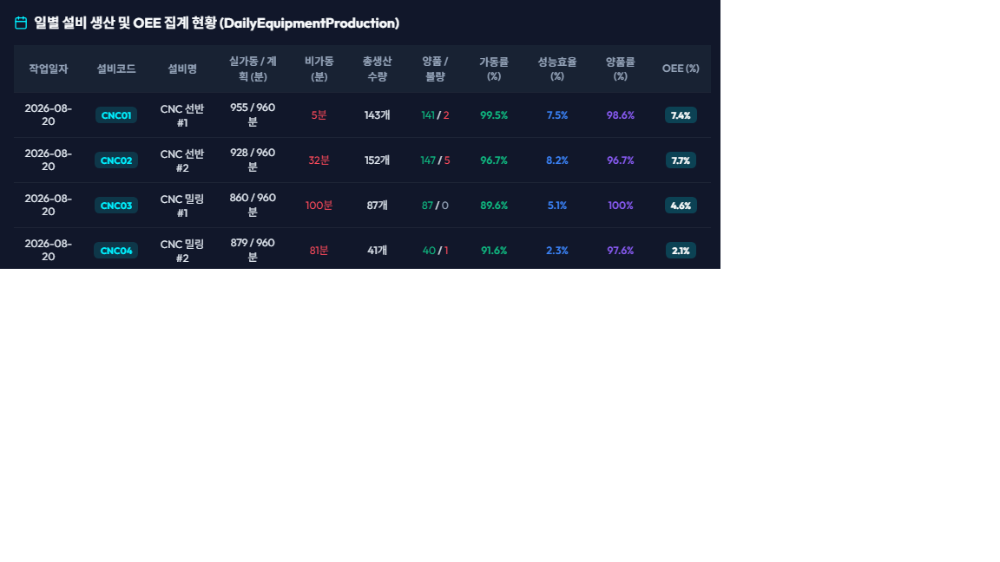

### AC-09. 완제품 출하

관리자가 완료된 작업지시의 제품을 선택해 수량과 납품처를 입력하고 출하한다.

- 기대 결과: 완제품 재고가 감소하고 출하 이력이 생성된다.
- 확인 항목: 출하 수량, 납품처, 출하 이력, 재고 초과 출하 차단.
- 시연 자료: 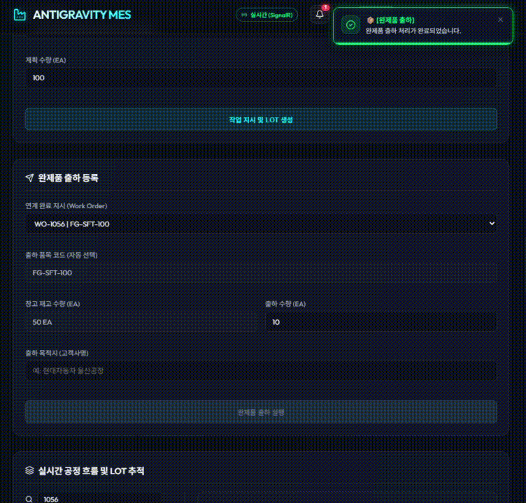

## 4. 실시간 동기화 검수

관리자와 작업자 화면을 동시에 열고 다음 이벤트마다 두 화면이 최신 상태로 갱신되는지 확인한다.

- 작업지시 생성 및 생산 시작
- OPC Counter 증가와 설비 온도 변경
- 불량 등록, HOLD 및 보류 해제
- 공정 이동과 생산 마감
- 비가동 사유 등록과 출하

통과 기준은 SignalR 이벤트 수신 후 관련 목록, LOT 추적, 설비 현황, 재고 및 OEE 화면에서 새로고침 없이 최신 서버 상태가 표시되는 것이다.

## 5. 최종 합격 기준

- 작업지시 → LOT → 생산 → 공정 이동 → 마감 → 출하 흐름을 완료할 수 있다.
- Counter 기반 양품 자동 수집과 작업자 불량 수동 등록이 중복되지 않는다.
- HOLD, 재작업, 비가동 사유가 LOT·설비 이력 및 분석 화면에 일관되게 반영된다.
- 설비별 생산량·비가동 데이터가 OEE 분석에 반영된다.
- 재고, 출하 이력, 작업지시 상태가 관리자·작업자 화면과 서버 데이터에서 일치한다.

## 6. 검수 결과 기록

| 항목          | 결과               | 확인일 | 확인자 | 비고 |
| ------------- | ------------------ | ------ | ------ | ---- |
| AC-01 ~ AC-09 | Pass / Fail / 보류 |        |        |      |
| 실시간 동기화 | Pass / Fail / 보류 |        |        |      |
| 최종 합격     | Pass / Fail / 보류 |        |        |      |
