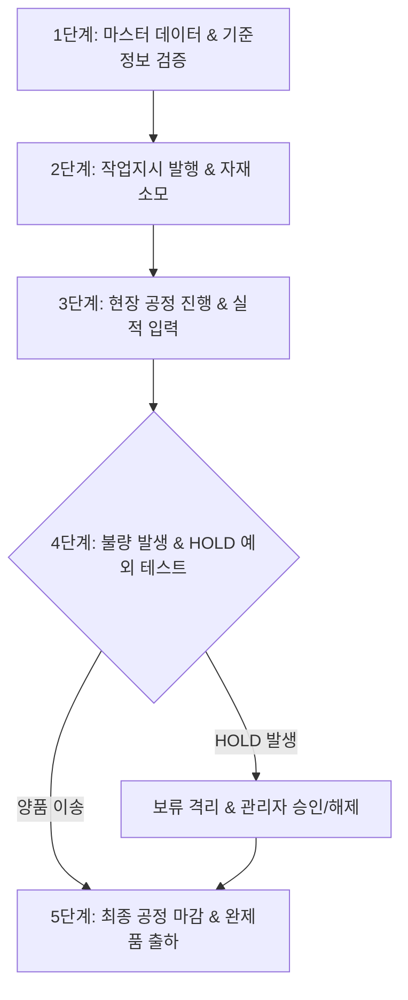
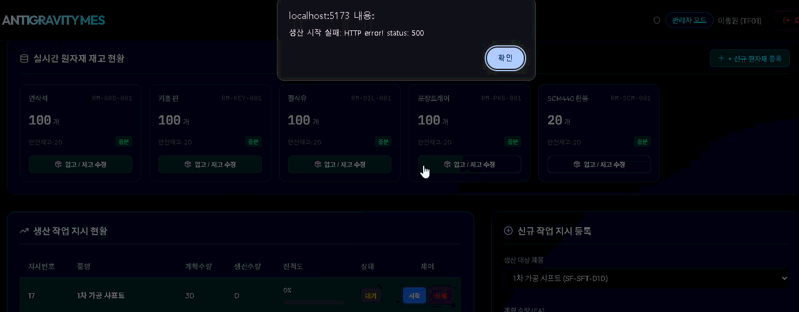

# 🏭 Smart Factory MES 솔루션 현장 검증 & 수용 테스트(UAT) 가이드

> 개발 완료된 MES 솔루션을 **실제 제조 현장(공장/라인)에 적용하기 전**, 업무 프로세스 일치성, 실시간 데이터 무결성, 현장 예외 상황 대응력을 검증하는 **실제 솔루션 현장 테스트(User Acceptance Test & Pilot Operation) 가이드**입니다.

---

## 📌 1. 솔루션 테스트 목표 및 준비사항

### 🎯 핵심 테스트 목표
1. **제조 프로세스 검증**: 원자재 입고부터 작업지시, 공정 진행, 품질 보류(HOLD), 최종 출하까지 전체 수명주기가 현장 흐름과 완벽히 일치하는가?
2. **이중 안전 방어막 검증**: 현장 작업자의 실수(양품 0개 이송, HOLD 상태 강제 진행 등)를 프론트/백엔드가 확실히 차단하는가?
3. **실시간 가시성 및 추적성**: 5초 Auto-Polling 동기화 및 타임라인 이력 추적(Traceability)이 현장 상황을 정확히 반영하는가?

### 🛠️ 테스트 환경 구성
* **테스트 샌드박스 DB**: 기존 개발 DB와 분리된 시뮬레이션용 데이터베이스 구축
* **테스트 장비 및 단말**:
  * **관리자 PC**: 브라우저 (Chrome/Edge - 관리자 대시보드 점검)
  * **현장 터미널**: 작업장 PC, 태블릿, 키오스크 화면 (작업자 대시보드 점검)
  * **입력 디바이스**: 바코드/QR 스캐너, 현장 키패드/터치스크린 (해당 시)

---

## 🔄 2. 시나리오별 실제 솔루션 현장 테스트 절차

---

### 1단계: 마스터 데이터 & 기준정보 검증 (Master Data Verification)
실제 공정에서 사용하는 품목, 공정, 공구, 사유 코드가 제대로 세팅되었는지 확인합니다.

* **테스트 내용**:
  1. `관리자 대시보드` ➡️ `원자재 관리` 모달에서 신규 원자재(예: `원자재-A`) 등록.
  2. 초기 재고량(`100 EA`) 및 안전 재고량(`safetyQty: 20 EA`) 등록.
  3. 빠른 입고 기능 (`+N EA`)을 통해 재고가 즉시 반영되는지 확인.
* **통과 기준**:
  * 등록 후 재고 목록에 정확히 표출되며, 안전재고 미만 시 `부족` 배지가 표출되어야 함.
  
  

---

### 2단계: 작업 지시(WO) 발행 및 자재 수급 검증 (Work Order & Material Check)
생산 계획에 맞춰 작업 지시를 내리고 재고가 자동 검증되는지 확인합니다.

* **테스트 내용**:
  1. `작업지시 등록 폼`에서 `원자재-A` 30개 생산 지시 발행.
  2. **재고 충분 시**: LOT 번호가 자동 발급되고 상태가 `RELEASED` ➡️ `WIP`로 전환되는지 확인.
  3. **재고 부족 예외 테스트**: 현재 재고(20개)보다 많은 수량(30개) 지시 발행 시도.
* **통과 기준**:
  * 재고 부족 시 지시 발행이 즉시 차단되고 경고 메시지 모달이 표출되어야 함.
  
  

---

### 3단계: 현장 공정 진행 및 실적 입력 (Floor Execution & Tracking)
현장 작업자가 터미널에서 공정별 수량을 입력하고 이송하는 흐름을 테스트합니다.

* **테스트 내용**:
  1. `작업자 대시보드` 접속 ➡️ 해당 작업 지시(WO) 선택.
  2. 7단계 공정 스태퍼 중 1공정 선택 ➡️ **사용 공구 ID (`toolID: TOOL-01`)** 및 **양품 수량(10개)** 입력.
  3. `다음 공정 이송 (MoveProcess)` 버튼 클릭.
* **통과 기준**:
  * 1공정이 완료 표시되며 2공정으로 스태퍼가 이동함.
  * 관리자 대시보드의 `LOT 추적 타임라인`에 공구 ID(`TOOL-01`)와 진행 시간이 실시간 표출됨.
    
---

### 4단계: 현장 예외 상황 & 불량 보류(HOLD) 방어 테스트 (Safety Guards Test)
가장 중요한 **현장 오류 방어 능력**을 직접 시험합니다.

#### 예외 시험: 불량 발생 및 HOLD 보류 전환
* **시도**: 불량 수량 `2개` 입력 및 **불량 사유 코드 (`reasonCode: DEFECT-CHIP`)** 선택 후 등록.
* **기대 결과**: 
  * LOT 상태가 `HOLD`로 자동 전환됨.
  * 작업자 화면에 `🚫 LOT 보류(HOLD) 상태` 배지가 표출되며 추가 공정 이동 버튼이 완벽히 비활성화됨.
  
#### 예외 시험: 관리자 품질 승인 / 보류 해제
* **시도**: 관리자 대시보드에서 해당 `HOLD` LOT 건 확인 ➡️ 원인 파악 후 보류 해제(`RELEASE`) 승인.
* **기대 결과**: LOT 상태가 다시 `WIP`로 복구되며 작업자가 공정을 재개할 수 있음.
  

---

### 5단계: 생산 마감 & 완제품 출하 (Completion & Shipment)
목표 수량을 채우고 마감 및 출하까지 이어지는지 확인합니다.

* **테스트 내용**:
  1. final 공정까지 양품 수량 달성 후 `생산 마감 (CompleteWorkOrder)` 클릭.
  2. LOT 상태가 `DONE`으로 변경되었는지 확인.
  3. `완제품 출하 (Shipment)` 메뉴 이동 ➡️ 출하 등록 실행.
* **통과 기준**:
  * 목표 수량 미달 시 마감 요청 시 백엔드에서 예외가 발생하여 마감이 차단되어야 함.
  * 완제품 출하 완료 시 완제품 재고 차감 및 출하 이력 레코드가 정상 생성되어야 함.
  

---

## ⚡ 3. 현장 특화 추가 검증 요소 (Field-Specific Checks)

### 👥 1. 동시 접속 & 데이터 동기화 (Concurrency)
* **테스트 방법**: 관리자 PC 1대, 현장 터미널 2대에서 동시에 동일한 LOT/WO를 조회 및 입력.
* **점검 항목**: 작업자가 실적을 입력했을 때 5초 이내에 관리자 화면의 대시보드 및 타임라인에 자동 갱신(Auto-Polling)되는지 확인.

### 📱 2. 현장 단말 사용성 (Usability)
* **테스트 방법**: 현장 작업장 터치스크린/태블릿 환경에서 장갑을 끼고 조작 시도.
* **점검 항목**: 버튼 크기, 폰트 가독성, 색상 대비(Glassmorphism 및 Dark/Light 테마 시인성) 검증.

### 🌐 3. 네트워크 단절 및 시스템 복구 (Resilience)
* **테스트 방법**: 작업자가 실적을 입력하는 도중 네트워크(Wi-Fi)를 끊었다가 재연결.
* **점검 항목**: 데이터 중복 등록이나 DB 락(Deadlock) 없이 안전하게 오류 메시지가 뜨거나 재시도되는지 확인.

---

## 📊 4. 솔루션 현장 검증 결과 기록표 (UAT Sign-off Sheet)

| 검증 단계 | 테스트 항목 | 주요 확인 포인트 | 통과 여부 | 비고/개선점 |
| :--- | :--- | :--- | :---: | :--- |
| **1. 마스터** | 품목/재고 등록 | 안전재고 미만 시 `부족` 경고 배지 표시 | PASS / FAIL | |
| **2. 작업지시** | WO 발행 및 재고 차감 | 재고 부족 시 지시 발행 차단 팝업 표출 | PASS / FAIL | |
| **3. 공정진행** | 스태퍼 이동 및 이력 | 사용 공구 ID(`toolID`) 타임라인 시각화 | PASS / FAIL | |
| **4. 불량보류** | HOLD LOT 공정 차단 | `HOLD` 상태 시 공정 이동 및 마감 차단 | PASS / FAIL | |
| **5. 출하마감** | 목표 미달 마감 차단 | 미달 수량 마감 요청 시 백엔드 예외 발생 | PASS / FAIL | |
| **6. 동기화** | 실시간 Polling 갱신 | 작업자 실적 입력 후 5초 내 대시보드 갱신 | PASS / FAIL | |
